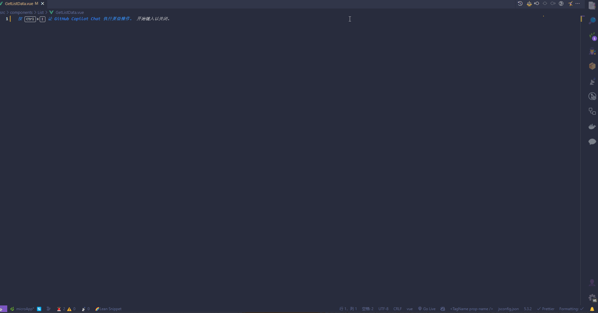

<br>

<p align="center">

</p>

<h1 align="center">Lean Snippet</h1>
<h3 align="center">🌈 Smart Code Snippets Extension for Visual Studio Code</h3>

<p align="center">
<a href="https://marketplace.visualstudio.com/items?itemName=IceyWu.LeanSnippet" target="__blank"></a>
</p>

[🚀 Download from Marketplace](https://marketplace.visualstudio.com/items?itemName=IceyWu.LeanSnippet)

**English** | [中文](./README.zh-CN.md)

## ✨ Features

- 🎯 **Smart Sidebar Panel** - Browse and manage code snippets visually
- 🌈 **Multi-Language Support** - JavaScript, TypeScript, Vue, HTML snippets
- ⚡ **Quick Insert** - One-click snippet insertion with hotkeys
- 🎨 **Custom Icons** - Beautiful language-specific icons
- 📝 **Log Management** - Smart console.log insertion and cleanup
- 🔧 **Interactive Actions** - Add, import, export snippets
- 💾 **TypeScript Powered** - Full TypeScript rewrite for better performance

<br>

## 🚀 Using

### Sidebar Panel

1. Click the **Lean Snippet** icon in the activity bar
2. Browse snippets by language (JavaScript, TypeScript, Vue, HTML)
3. Double-click or use action buttons to insert snippets
4. Use the preview feature to see snippet details

<p align="center">

</p>

## ⌨️ Keyboard Shortcuts

| Shortcut | Description |
|----------|-------------|
| `Ctrl+Shift+L` / `Cmd+Shift+L` | Insert log statement with variable |
| `Ctrl+Shift+/` / `Cmd+Shift+/` | Insert log statement for selection |
| `Ctrl+Shift+D` / `Cmd+Shift+D` | Delete all console.log statements |
| `Ctrl+Shift+J` / `Cmd+Shift+J` | Insert consolePlus statement |

### Examples

**Log with variable:**

```javascript
console.log('🍧-----text-----', text);
```

**Log for selection:**

```javascript
console.log('🌳result------------------------------>');
```

## 📝 Code Snippets

### JavaScript & TypeScript

| Prefix | Description | Content |
|--------|-------------|---------|
| `lre` | API request demo | `async/await request pattern` |
| `lcl` | Console log with variable | `console.log('🌈-----xxx-----', xxx)` |
| `laf` | Arrow function | `const func = () => {}` |
| `lif` | If-else statement | `if(){...} else{...}` |
| `lsw` | Switch statement | `switch(){case: break; default: break;}` |
| `lcc` | JSDoc comment | `/** * @func fnName */` |
| `linterface` | TypeScript interface | `interface InterfaceName {}` |
| `ltype` | TypeScript type alias | `type TypeName = type` |
| `ltsfunc` | TypeScript function | `function name(): returnType {}` |
| `lclass` | TypeScript class | `class ClassName {}` |
| `lenum` | TypeScript enum | `enum EnumName {}` |
| `ltrycatch` | Try-catch block | `try{} catch(error: unknown){}` |

### Vue 3 Composition API

| Prefix | Description | Content |
|--------|-------------|---------|
| `lvc` | Vue 3 component template | Complete component structure |
| `lvb` | Vue base template | Basic Vue template |
| `lref` | Reactive reference | `const valName = ref(..)` |
| `lrea` | Reactive object | `const valName = reactive(..)` |
| `lcom` | Computed property | `const valName = computed(..)` |
| `lwa` | Watch | `watch(..)` |
| `lwe` | Watch effect | `watchEffect(..)` |
| `lmo` | onMounted | `onMounted(..)` |
| `lbm` | onBeforeMount | `onBeforeMount(..)` |
| `lbu` | onBeforeUnmount | `onBeforeUnmount(..)` |
| `lun` | onUnmounted | `onUnmounted(..)` |
| `lvem` | Define emits | `const emit = defineEmits([])` |
| `lvpr` | Define props | `const props = defineProps({})` |
| `lvde` | Define expose | `defineExpose({})` |

### HTML Utilities

| Prefix | Description | Content |
|--------|-------------|---------|
| `lrem` | Lorem ipsum English | English placeholder text |
| `lremc` | Lorem ipsum Chinese | Chinese placeholder text |
| `lremn` | Lorem ipsum numbers | Number placeholder text |

## 🛠️ Development

This extension is built with TypeScript and follows modern VS Code extension development practices:

- **TypeScript**: Full type safety and better development experience
- **Modular Architecture**: Clean separation of concerns
- **Custom Icons**: Beautiful SVG icons for better visual experience
- **Interactive Sidebar**: Visual snippet management with preview functionality

## 🔧 Installation

1. Install from [VS Code Marketplace](https://marketplace.visualstudio.com/items?itemName=IceyWu.LeanSnippet)
2. Or search for "Lean Snippet" in VS Code Extensions panel
3. Reload VS Code and enjoy!

## 🚀 About

**Lean Snippet** is designed to boost your coding productivity by providing:

- Smart code snippet management
- Quick insertion tools
- Visual browsing experience  
- Multi-language support
- Customizable and extensible

With the rapid development of modern web technologies, developers need efficient tools to reduce repetitive work and improve code quality. Lean Snippet encapsulates common patterns and best practices into easily accessible snippets, optimizing both code size and development efficiency while greatly improving code readability and maintainability.

**Enjoy coding with Lean Snippet!** 🌈

## 📄 License

MIT License &copy; 2023-PRESENT [Icey Wu](https://github.com/IceyWu)
