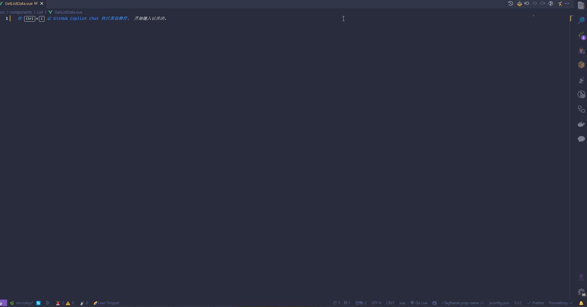

# Lean Snippet

> Code snippet manager & log toolkit for VS Code.

[](https://marketplace.visualstudio.com/items?itemName=IceyWu.LeanSnippet)

**English** | [中文](./README.zh-CN.md)

## Features

- **Snippet management** — browse, add, import/export snippets from the sidebar
- **Multi-language** — JS, TS, Vue, HTML built-in; supports custom languages
- **Log tools** — insert named `console.log`, bulk delete all logs
- **Keybinding editor** — view and customize shortcuts in the panel

<p align="center">
  
</p>

## Keyboard Shortcuts

| Shortcut       | Action                            |
| -------------- | --------------------------------- |
| `Ctrl+Shift+L` | Insert log with selected variable |
| `Ctrl+Shift+/` | Choose log type to insert         |
| `Ctrl+Shift+D` | Delete all log statements in file |

> Mac: replace `Ctrl` with `Cmd`. All shortcuts are customizable in the panel.

### Log Examples

```js
// Select `text`, press Ctrl+Shift+L →
console.log("🍧-----text-----", text);

// Press Ctrl+Shift+D → all console.log removed
```

## Snippet Reference

### JavaScript / TypeScript

| Prefix       | Description                 |
| ------------ | --------------------------- |
| `lre`        | Async request pattern       |
| `lret`       | Request with try-catch      |
| `lcl`        | `console.log` with variable |
| `laf`        | Arrow function              |
| `lif`        | If-else                     |
| `lsw`        | Switch-case                 |
| `lcc`        | JSDoc comment               |
| `linterface` | TS interface                |
| `ltype`      | TS type alias               |
| `ltsfunc`    | TS function                 |
| `lclass`     | TS class                    |
| `lenum`      | TS enum                     |
| `ltrycatch`  | Try-catch block             |

### Vue 3

| Prefix                   | Description                                    |
| ------------------------ | ---------------------------------------------- |
| `lvc`                    | Component template                             |
| `lvb`                    | Base template                                  |
| `lref`                   | `ref()`                                        |
| `lrea`                   | `reactive()`                                   |
| `lcom`                   | `computed()`                                   |
| `lwa` / `lwe`            | `watch` / `watchEffect`                        |
| `lmo` / `lun`            | `onMounted` / `onUnmounted`                    |
| `lvem` / `lvpr` / `lvde` | `defineEmits` / `defineProps` / `defineExpose` |

### HTML

| Prefix  | Description              |
| ------- | ------------------------ |
| `lrem`  | English placeholder text |
| `lremc` | Chinese placeholder text |
| `lremn` | Numeric placeholder text |

## Install

1. Search **Lean Snippet** in the VS Code Extensions panel
2. Or install from [Marketplace](https://marketplace.visualstudio.com/items?itemName=IceyWu.LeanSnippet)

## License

MIT &copy; 2023-PRESENT [Icey Wu](https://github.com/IceyWu)
